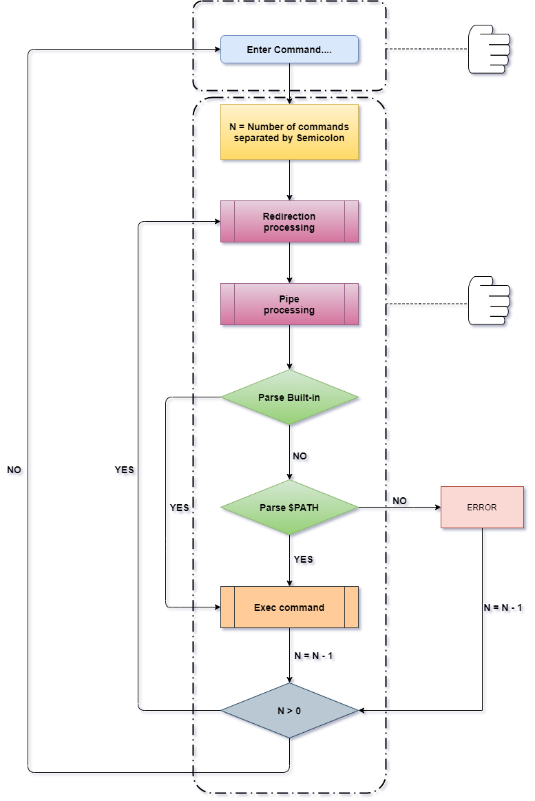

# :pineapple:***PINEAPPLE_with_termcap***
***minishell by [gmoon](https://github.com/moon9ua) and termcap by [sanam](https://github.com/simian114).***<br>
***@ 42 Seoul***

-----
### :punch: bash 쉘 처럼 다양한 키보드 입력 받을 수 있게 minishell 수정 중...

-----



-----
### :question: How To Install?
- linux

  ```
    1. sudo apt-get install libncurses5-dev
    2. git clone https://github.com/simian114/minishell_with_termcap.git ; cd minishell_with_termcap ; make
  ```

- Mac

  ```
    git clone https://github.com/simian114/minishell_with_termcap.git ; cd minishell_with_termcap ; make
  ```
-----

### :o:	Implmented
- Move cursor Left and Right using :arrow_left:, :arrow_right:
- Move cursor Up and down using **Ctrl + :arrow_up:, Ctrl + :arrow_down:**
- Move cursor Home and End of the command line using **HOME, END**
- Edit the line where the cursor is located
- Command history navigating using :arrow_up:, :arrow_down:

-----
### :x: Not Implemented
- ctrl + :arrow_left:
- tab
- Cut, Copy, Paste
- ', "
- Escaping

-----
### :bug: BUG
- 입력줄 중간으로 커서 옮긴 후 입력 쫙 하면 다음 줄로 넘어갈 때 심각한 오류 발생
- **Ctrl + :arrow_up:, :arrow_down:** 에 문제 있는듯..

-----
### :heavy_exclamation_mark: Built-in functions?
- built-in 함수란 쉘 자체에 내장되어 있는 함수들을 뜻한다.
  - [bash 빌트인 명령어](https://zetawiki.com/wiki/Bash_%EB%B9%8C%ED%8A%B8%EC%9D%B8_%EB%AA%85%EB%A0%B9%EC%96%B4)
- built-in 명령어는 쉘 자체에 내장되어 있기 때문에 minishell에서 직접 구현 해야만 사용할 수 있다.  
- built-in 이 아닌 함수들은 쉘 자체에 내장되어 있는것이 아닌 프로그램 형태로 존재한다. 따라서 ***minishell***에서 프로그램으로 만들어져 있는 명령어를사용하고 싶다면 ***$PATH*** 환경변수에서 프로그램들의 위치를 찾고 실행하면 된다.  

-----
### :heavy_exclamation_mark: SIGNAL
- 시그널은 신호를 보낸다고 생각하면 된다. 포인터 연산이나 할당되지 않은 메모리에 접근하면 SIGSEGV나 SIGABRT 등의 시그널이 발생하고 프로그램이 종료되듯이 minishell에서는 ***Ctrl + c 나 Ctrl + \\*** 를 눌러서 직접 시그널을 보내고 시그널이 보내졌을 때 그에 맞는 함수(핸들러)를 실행해야한다.  
  
- 시그널이 발생하면 그 시그널에 맞는 함수를 실행시키게 만든다! (함수를 따로 만들지 않으면 기본 동작으로 ***프로세스가 종료됨***  

- SIGINT
  - bash 입력 단계에서 SIGINT 를 발생시키면 입력줄이 다음 줄로 넘어간다.
  - 어떤 명령이 실행 중일 때 SIGINT를 발생시키면 프로그램이 종료된다. (자식 프로세스가 종료 된다.)  
- SIGQUIT
  - bash 입력 단계에서 SIGQUIT를 발생시키면 아무런 일도 일어나지 않는다.
  - 어떤 명령이 실행 중일 때 SIGQUIT를 발생시키면 CORE DUMP를 남기고(?) 종료된다. (자식 프로세스가 종료 된다.)  

- 핸들러 만들기
  - 두 시그널 모두 첫 번째 경우는 get_line 단계에서 처리를 해주면 되고 두 번째 경우는 명령 실행 단계에서 시그널을 처리해 주면 된다.  
  - 시그널은 함수를 설치하는 느낌(?)이므로 get_line 단계에서 하나 설치하고 get_line이 끝난 다음에 하나 더 설치하면 된다.  
  
- Ctrl + d
  - Ctrl + d는 EOF 를 발생시킨다. 이건 별로 따로 처리할 필요는 없던걸로 기억한다. 다만 보너스 파트를 할 때는 조금 다르게 접근해야한다.
-----
### :heavy_exclamation_mark: Redirection
- 리다이렉션은 명령을 실행하기 전에 처리를 해야한다. 그리고 파이프보다도 먼저 처리가 되어야 한다. 리다이렉션 뒤에 나오는 인자 open 해서 fd를 구한다.  
- **\> 또는 >>**
  - \> 나 >> 는 모니터로의 출력을 다른 파일로 연결시키는 돌리는 역할을 한다. 모니터로의 출력은 1 번. 이 1를 앞에서 구한 fd값으로 덮어주면 된다.  
  - dup2(int oldfd, int newfd) 함수를 사용하면 된다. 아래처럼 사용하면 된다.
    - dup2(fd, STDOUT_FILENO); // 이런식으로 사용하면 앞으로의 출력은 모니터로가 아니라 열려있는 fd로 전달된다.
- **<**
  - < 는 > 와 반대로 입력의 방향을 바꾸는 역할을 한다. 입력은 보통 키보드로 전달되는데 그 입력을 키보드가 아닌 다른 파일로 바꾼다.
  - 처리하는 방법은 위와 동일하다.
-----
### :heavy_exclamation_mark: termcap과 get_line
- get_line 함수를 만들 때 가장 먼저 해야하는건 현재 터미널의 width를 구하는 것. icotl 라이브러리와 함수를 이용하면 된다.  

- 터미널의 설정 바꿨으면 함수가 끝날 때 원상복구 시켜주자.  

- 기존의 터미널은 Canonical 입력 상태. 이 상태일 때 read(0, buf, 1000) 이런 함수가 있으면 EOF가 되거나 1000개의 입력을 받으면
read가 끝난다. 그리고 입력이 끝나면 그제서야 buf에 입력이 시작된다. minishell에서 화살표 등의 다른 키가 먹히지 않는 이유가 이거 때문인듯.
따라서 하나의 입력이 들어올 때 마다 바로 read가 종료되고 그 다음 작업을 진행할 수 있도록 Canonical 설정을 꺼주자.(Ctrl + d가 EOF가 아니라 EOT로 바뀐다)  

- termcap으로 입력을 받는 함수를 만들 때, 눈에 보이는 커서의 위치와 실제 메모리 상의 커서 위치가 다를 수 있다.
그럼 바로.. 끔찍한 일 발생. 따라서 커서의 위치를 추적하는 변수를 꼭 하나 만들어 두자.  

- Canonical 모드를 껐으므로 하나의 입력이 들어올 때 마다 각 입력에 해당하는 함수가 동작한다.  
  ```
  - 새로운 문자를 추가하는 함수(Insert)
    - command line의 끝
    - command line의 중간
  - Delete 함수
  - 커서를 움직이는 함수
  - Command History navigating
  - Signal
  - Ctrl + d (End Of Transmission)
  ```  
  
- 모든 입력들은 ***커서가 움직인다*** 라는 하나의 공통점을 갖는다. 따라서 아래와 같은 방법으로 함수를 만들면 좋을거 같다.(나는 멍청해서 이렇게 안했다..)
  - 커서의 위치를 추적하는 변수 두 개 선언.
    - ex_cursor_pos
    - cur_cursor_pos
  - 입력에 대한 함수들은 실제 커서를 움직이지 않고 cursor_pos들의 값들만 수정한다.
    - ex_cursor_pos = cur_cursor_pos
    - cur_cursor_pos = new cursor pos
  - 입력 함수가 종료 되면 이제 move_cursor 함수가 동작한다. 이 함수는 아래와 같이 3 가지 경우의 수가 존재한다.
    - ex_cursor_pos == cur_cursor_pos
    - ex_cursor_pos > cur_cursor_pos
    - ex_cursor_pos < cur_cursor_pos
  - :heavy_exclamation_mark: ***커서가 다음 줄 또는 이전 줄로 넘어가는 경우 주의하자.***  

- Signal을 minishell의 main에도 설치하고 get_line 함수에도 따로 설치하자.  

- terminal을 다루기 위해서는 Capability를 이용해야한다. Capability는 세 종류가 있다. (man termcap, man terminfo, [gnu 문서](https://www.gnu.org/software/termutils/manual/termcap-1.3/html_node/termcap_5.html))
  - Boolean   -> int tgetnum(char \*name)
  - Numeric   -> int tgetflag(char \*name)
  - String    -> char \*tgetstr(char \*name)
- -> 뒤에 있는 함수들은 각 Capability를 사용하기 위한 함수다. 인자로 알맞은 Capability를 넣어주면 된다.  

- 아래는 내가 사용한 String Capability 종류와 사용 예. (참고로 나는 String 만 사용했다. 영어 해석이 잘 안되서,,,)
  ```    
    nd : 커서를 오른쪽으로 움직인다.
    le : 커서를 왼쪽으로 움직인다.
    do : 커서를 아래로 움직인다. (확실히 기억은 안나는데, 이 녀석은 아마 커서를 아래로 내리고 Col 0으로 움직인다.)
    up : 커서를 위로 움직인다. (do랑 다르게 이 녀석은 Col은 그대로 유지하면서 위로 이동한다.)
    sc : 현재 커서 위치를 저장한다.
    rc : 커서 위치를 sc로 저장했던 곳으로 되돌린다.
    dc : 커서가 위치한 곳의 문자 하나를 지운다.
    dl : 커서가 위치한 줄을 지운다.
    cr : 커서가 위치한 줄의 Col 0으로 커서를 움직인다.
    ===============================================
    사용 예시
    ***********************************************
    tputs(tgetstr(nd, NULL), 1, &ft_putchar_fd); // 커서를 오른쪽으로 움직임
    ***********************************************
    char *tgetstr(char *name)함수는 뭔가를 가져온다! 라는 느낌이고
    가져오는걸 쓰는 함수는 tputs인듯. 정확히는 모르겠다.
    
    나는 string만 사용했는데, Numeric에도 쓸만한 Capability가 보인다.
    "co"는 눈에 보이는 커서의 Numbers of Col을 return 하는것 같다. 아래 처럼 쓰면 될듯.
        int cur_col = tgetnum("co");
    Boolean에는 "hc"가 있는데 설명에 hardcopy라고 써있다. copy를 해주는 녀석일까? 나중에 알아보자.
  ```
